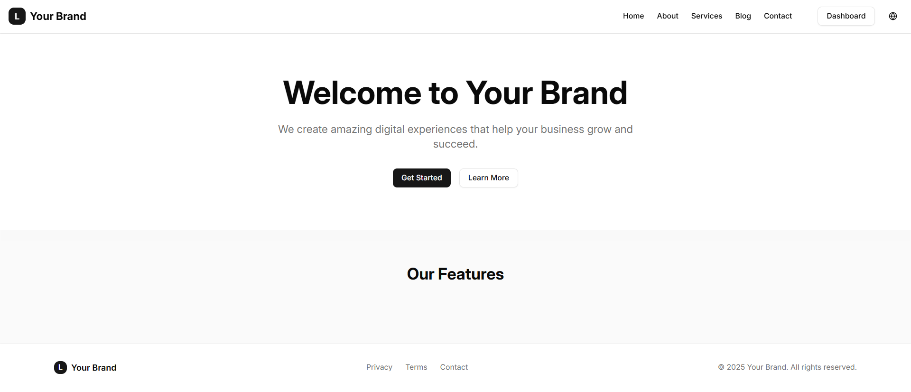
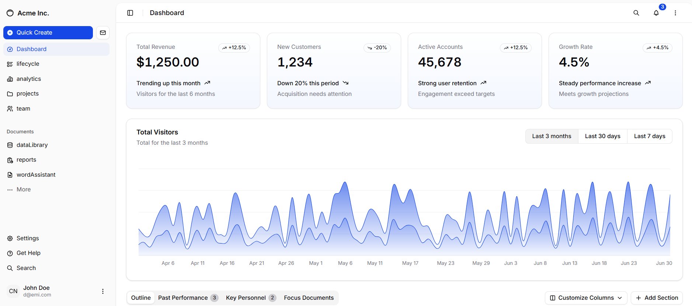
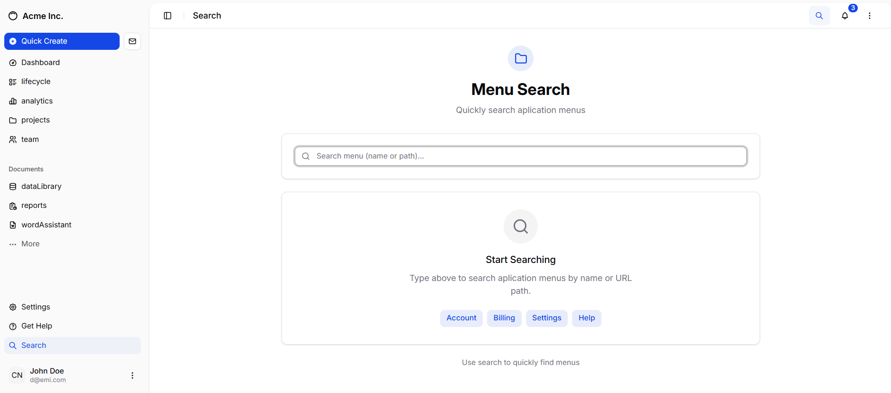
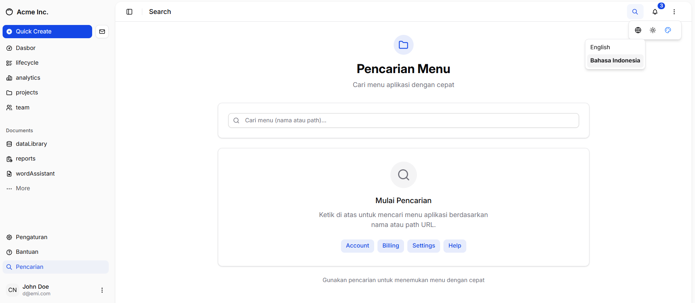
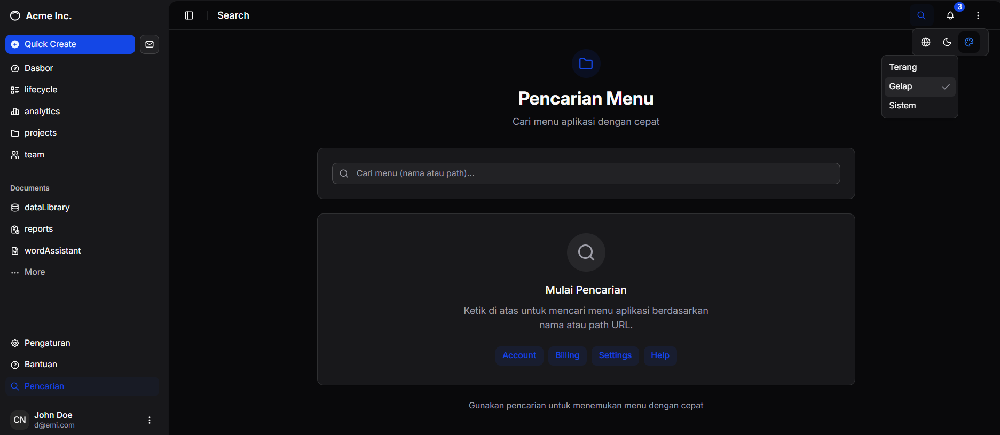
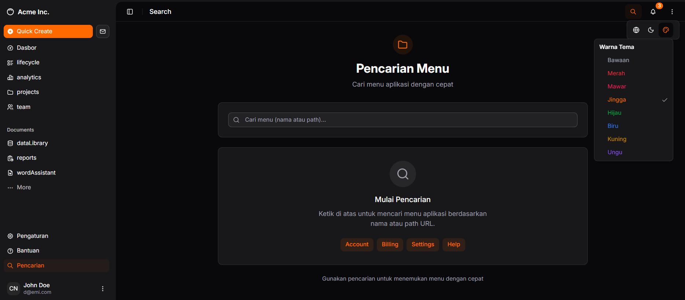
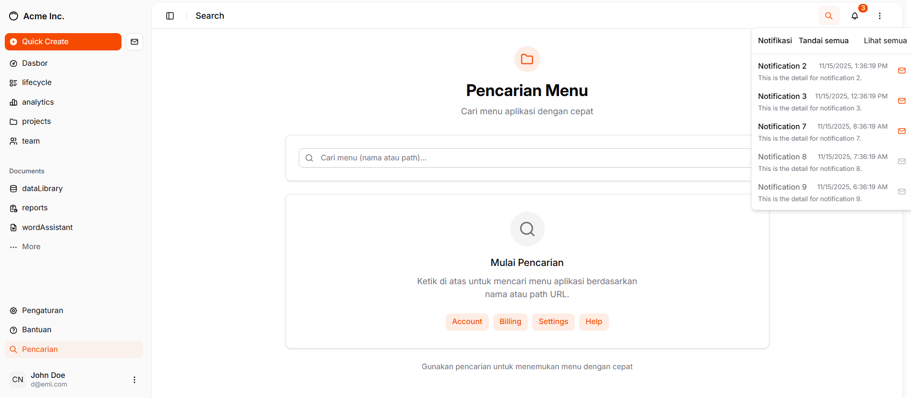
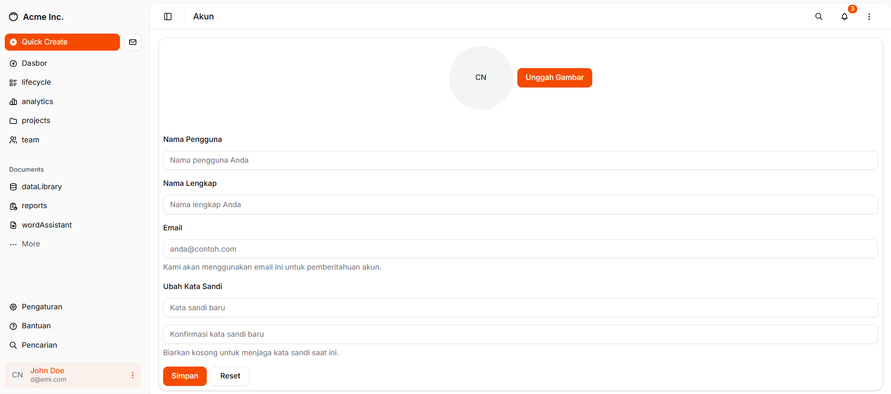
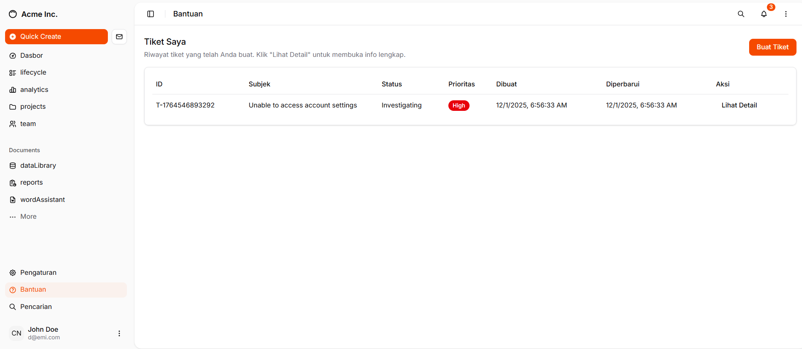

# react-router-shadcn

REACT ROUTER -SHADCN is a Shadcn Admin UI built with `Shadcn` , `Vite` , `React`,`React-Router`





















## 🚀 Quick Start

```bash
npm install
npm run dev
```

Your application will be available at `http://localhost:5173`.


